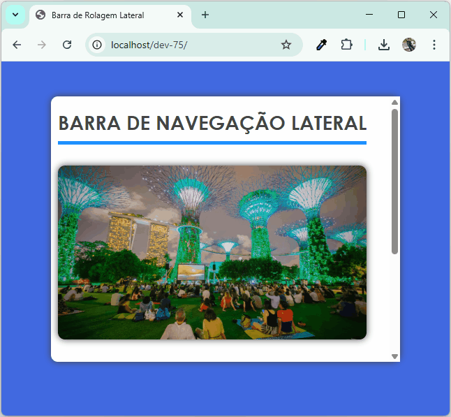
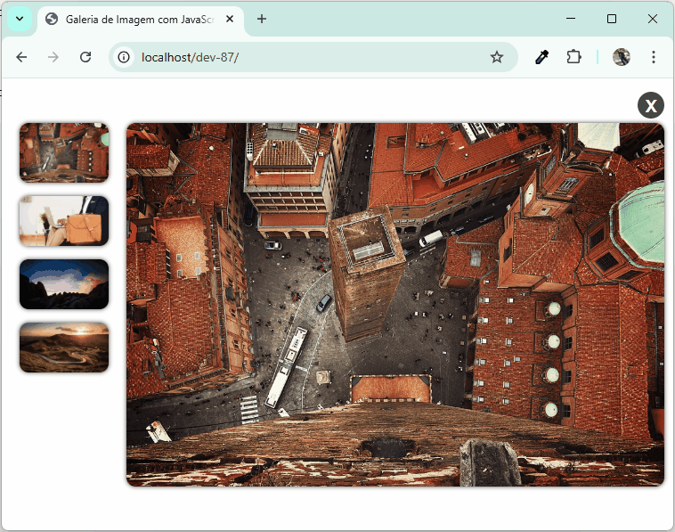
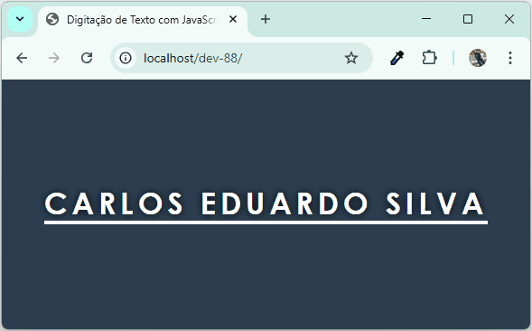

### Propósito

Neste repositório serão tratados todos os assuntos relacionados ao desenvolvimento de cada ensinamento aprendido através do canal DarkCode.

### Fonte

Canal do Youtube utilizado como base.

 

### Código em JavaScript para gerar a tabela de acordo com cada card que foi desenvolvido neste repositório.

```js
const corpoDaTabela = document.querySelector('table tbody');

for (let contador = 0; contador < 94; contador++) {

  // Cria a linha
  const linhaDaTabela = document.createElement('tr');

  // Primeira célula (texto)
  const celulaDaLinha = document.createElement('td');
  const conteudoDaCelula = document.createTextNode('DEV-' + (contador + 1));
  celulaDaLinha.appendChild(conteudoDaCelula);
  linhaDaTabela.appendChild(celulaDaLinha);

  // Segunda célula (imagem)
  const celulaDaLinha2 = document.createElement('td');
  const imagem = document.createElement('img');

  imagem.setAttribute('src', 'DEV-' + (contador + 1) + '/success.gif');
  imagem.setAttribute('alt', 'DEV-' + (contador + 1)); // boa prática
  imagem.style.width = '500px';

  celulaDaLinha2.appendChild(imagem);
  linhaDaTabela.appendChild(celulaDaLinha2);

  // Adiciona a linha completa ao corpo da tabela
  corpoDaTabela.appendChild(linhaDaTabela);
}
```

<table>
  <thead>
    <tr>
      <th>Desenvolvimento</th>
      <th>Resultado:</th>
    </tr>
  </thead>

  <tbody>
  <tr><td>DEV-1</td><td></td></tr><tr><td>DEV-2</td><td></td></tr><tr><td>DEV-3</td><td></td></tr><tr><td>DEV-4</td><td></td></tr><tr><td>DEV-5</td><td></td></tr><tr><td>DEV-6</td><td></td></tr><tr><td>DEV-7</td><td></td></tr><tr><td>DEV-8</td><td></td></tr><tr><td>DEV-9</td><td></td></tr><tr><td>DEV-10</td><td></td></tr><tr><td>DEV-11</td><td></td></tr><tr><td>DEV-12</td><td></td></tr><tr><td>DEV-13</td><td></td></tr><tr><td>DEV-14</td><td></td></tr><tr><td>DEV-15</td><td></td></tr><tr><td>DEV-16</td><td></td></tr><tr><td>DEV-17</td><td></td></tr><tr><td>DEV-18</td><td></td></tr><tr><td>DEV-19</td><td></td></tr><tr><td>DEV-20</td><td></td></tr><tr><td>DEV-21</td><td></td></tr><tr><td>DEV-22</td><td></td></tr><tr><td>DEV-23</td><td></td></tr><tr><td>DEV-24</td><td></td></tr><tr><td>DEV-25</td><td></td></tr><tr><td>DEV-26</td><td></td></tr><tr><td>DEV-27</td><td></td></tr><tr><td>DEV-28</td><td></td></tr><tr><td>DEV-29</td><td></td></tr><tr><td>DEV-30</td><td></td></tr><tr><td>DEV-31</td><td></td></tr><tr><td>DEV-32</td><td></td></tr><tr><td>DEV-33</td><td></td></tr><tr><td>DEV-34</td><td></td></tr><tr><td>DEV-35</td><td></td></tr><tr><td>DEV-36</td><td></td></tr><tr><td>DEV-37</td><td></td></tr><tr><td>DEV-38</td><td></td></tr><tr><td>DEV-39</td><td></td></tr><tr><td>DEV-40</td><td></td></tr><tr><td>DEV-41</td><td></td></tr><tr><td>DEV-42</td><td></td></tr><tr><td>DEV-43</td><td></td></tr><tr><td>DEV-44</td><td></td></tr><tr><td>DEV-45</td><td></td></tr><tr><td>DEV-46</td><td></td></tr><tr><td>DEV-47</td><td></td></tr><tr><td>DEV-48</td><td></td></tr><tr><td>DEV-49</td><td></td></tr><tr><td>DEV-50</td><td></td></tr><tr><td>DEV-51</td><td></td></tr><tr><td>DEV-52</td><td></td></tr><tr><td>DEV-53</td><td></td></tr><tr><td>DEV-54</td><td></td></tr><tr><td>DEV-55</td><td></td></tr><tr><td>DEV-56</td><td></td></tr><tr><td>DEV-57</td><td></td></tr><tr><td>DEV-58</td><td></td></tr><tr><td>DEV-59</td><td></td></tr><tr><td>DEV-60</td><td></td></tr><tr><td>DEV-61</td><td></td></tr><tr><td>DEV-62</td><td></td></tr><tr><td>DEV-63</td><td></td></tr><tr><td>DEV-64</td><td></td></tr><tr><td>DEV-65</td><td></td></tr><tr><td>DEV-66</td><td></td></tr><tr><td>DEV-67</td><td></td></tr><tr><td>DEV-68</td><td></td></tr><tr><td>DEV-69</td><td></td></tr><tr><td>DEV-70</td><td></td></tr><tr><td>DEV-71</td><td></td></tr><tr><td>DEV-72</td><td></td></tr><tr><td>DEV-73</td><td></td></tr><tr><td>DEV-74</td><td></td></tr><tr><td>DEV-75</td><td></td></tr><tr><td>DEV-76</td><td></td></tr><tr><td>DEV-77</td><td></td></tr><tr><td>DEV-78</td><td></td></tr><tr><td>DEV-79</td><td></td></tr><tr><td>DEV-80</td><td></td></tr><tr><td>DEV-81</td><td></td></tr><tr><td>DEV-82</td><td></td></tr><tr><td>DEV-83</td><td></td></tr><tr><td>DEV-84</td><td></td></tr><tr><td>DEV-85</td><td></td></tr><tr><td>DEV-86</td><td></td></tr><tr><td>DEV-87</td><td></td></tr><tr><td>DEV-88</td><td></td></tr><tr><td>DEV-89</td><td></td></tr><tr><td>DEV-90</td><td></td></tr><tr><td>DEV-91</td><td></td></tr><tr><td>DEV-92</td><td></td></tr><tr><td>DEV-93</td><td></td></tr><tr><td>DEV-94</td><td></td></tr></tbody>
</table>
